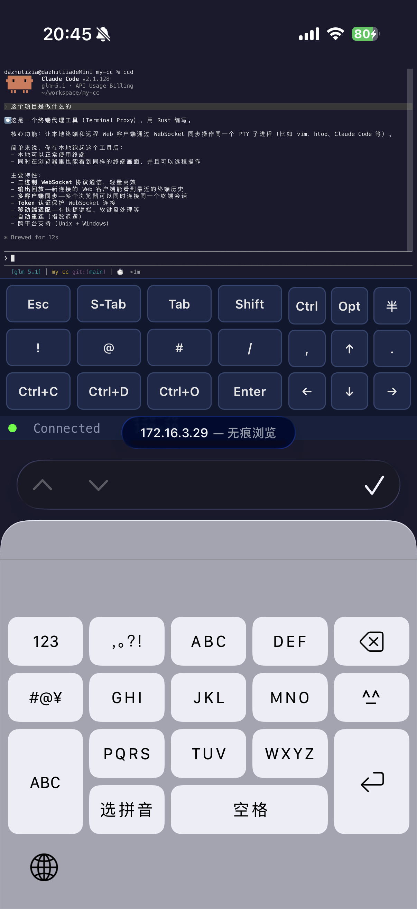

# my-cc

Rust-based terminal proxy. Runs arbitrary terminal programs (such as Claude Code, vim, htop) via a PTY proxy, enabling real-time synchronized operations between the local terminal and remote Web clients.

## Features

- **Local + Web Dual-End Sync** — Operations on either end are visible in real-time on the other
- **Multi-Client** — Supports simultaneous connections from multiple browsers
- **Output Replay** — Restores the terminal screen for new clients via raw PTY output logs upon connection
- **Resumable Transfer** — Resumes from the last received position upon reconnection, avoiding redundant replays (e.g., iOS background switching scenarios)
- **Adaptive Resizing** — Automatically syncs resize events from either the local terminal or Web end
- **Proportional Scaling** — Web client scales the terminal display proportionally to the actual browser width, ensuring consistency across desktop and mobile
- **Mobile Shortcuts** — Web client displays common shortcut buttons like Esc, Tab, Shift+Tab, arrow keys, and `/` on mobile devices
- **Keyboard Avoidance** — When the mobile keyboard pops up, the bottom status bar and shortcut bar automatically shift up to avoid being obscured
- **Token Authentication** — Optional WebSocket connection authentication
- **Auto-Reconnection** — Exponential backoff retry for Web clients upon disconnection

## Quick Start

```bash
# Build
cargo build --release

# Proxy run shell (default command)
my-cc

# Proxy run Claude Code
my-cc claude

# Specify port and authentication
my-cc --port 9090 --token mysecret

# Run with arguments
my-cc -- vim /path/to/file
```

Open `http://localhost:8080` in a browser to view the synchronized terminal.

When using a token, include it as a query parameter: `http://localhost:8080?token=mysecret`

## CLI Arguments

| Argument | Default | Description |
|------|--------|------|
| `command` | `$SHELL` (`powershell` on Windows) | Command to proxy and run |
| `args...` | None | Command arguments (passed after `--`) |
| `--port` | `8080` | Web server port |
| `--token` | None | WebSocket connection authentication token |

## Architecture

```
                    ┌──────────────────┐
                    │   my-cc (Rust)   │
                    │                  │
                    │  ┌─── PTY ────┐  │
                    │  │  Reader    │  │
                    │  │  Writer    │  │
                    │  └─────┬──────┘  │
                    │        │         │
                    │  ┌─ Event Bus ─┐  │
                    │  │ broadcast   │  │
                    │  │   output    │  │
                    │  │   resize    │  │
                    │  │ mpsc input  │  │
                    │  └──┬───┬───┬──┘  │
                    │     │   │   │     │
                    │  ┌──┘     ┌─┘┐   │
                    │  │        │  │   │
                    │  Local   Web │
                    │  Terminal  Server│
                    └──────────────────┘
                         ↕        ↕
                    Local Terminal  Web Client
```

- **PTY Manager** — `portable-pty` creates the pseudo-terminal, with a dedicated thread handling blocking I/O; on Windows, non-native executables (`.ps1`, `.cmd`, `.bat`) are wrapped with `powershell -NoLogo -Command` for execution, ensuring command parsing follows PowerShell precedence
- **Event Bus** — Tokio channels: `broadcast` distributes output, `mpsc` merges input, and retains recent PTY output for Web client replay
- **Network Server** — `hyper` serves static HTTP pages + `hyper-tungstenite` handles WebSocket connections
- **Web Frontend** — `xterm.js` renders the terminal, communicating via a binary WebSocket protocol; maintains the server PTY's rows/cols while proportionally scaling the display to available browser width, and provides shortcut buttons on mobile
- **Terminal** — Cross-platform terminal control: Unix listens for window changes via `SIGWINCH`; Windows polls for window changes and enables VT input to preserve terminal key sequences like Esc and Shift+Tab

### Binary WebSocket Protocol

The server and Web client communicate using a binary protocol with the format `[1-byte type][payload]`:

| Type | Value | Direction | Payload | Description |
|------|----|------|---------|------|
| Output | `0x01` | S→C | `[seq u64 BE][data]` | PTY output, carries a sequence number for resumable transfer |
| Input | `0x02` | C→S | `[data]` | User input |
| Resize | `0x03` | Bidirectional | `[rows u16 BE][cols u16 BE]` | Window size change |
| Mouse | `0x05` | C→S | — | Mouse events (reserved) |
| FeatureToggle | `0x06` | C→S | — | Feature toggle (reserved) |
| Ping | `0x07` | C→S | — | Heartbeat |
| Pong | `0x08` | S→C | — | Heartbeat reply |
| ReplayEnd | `0x09` | S→C | — | Replay complete, client can resume input |
| ReplayMode | `0x0A` | S→C | `[mode u8]` | Replay mode: `0`=incremental resume, `1`=full replay |

### Web Recovery & Scaling

When a new Web client connects, the server first sends the current PTY dimensions, then replays the recent raw PTY output log. The browser parses the same terminal output stream via `xterm.js`, minimizing character ghosting or layout discrepancies.

**Resumable Transfer**: The client maintains the sequence number (`seq`) of the last received output. Upon reconnection, it informs the server via the `lastSeq` URL parameter. The server only replays new data after that `seq`, avoiding full duplicates. If the cached log has been evicted (making continuation from that `seq` impossible), it automatically falls back to a full replay. This mechanism is particularly effective for iOS background switching, brief network interruptions, etc.

The Web client does not change the PTY's logical columns based on browser width. Instead, it maintains the server PTY's `rows/cols` and applies CSS proportional scaling to `xterm`'s actual rendering area:

- Width adjusts to fit the available browser width, allowing both zooming in and out
- If height exceeds, the terminal container handles scrolling
- Desktop and mobile use the same scaling logic

### Mobile Operations

The mobile Web client displays a shortcut bar below the terminal to compensate for the soft keyboard's lack of terminal control keys. It currently includes:

- `Esc`, `Tab`, `Shift+Tab`
- `Ctrl+C`, `Ctrl+D`
- `Enter`, `Backspace`
- Up, Down, Left, Right arrow keys
- `/`, for quickly invoking programs that support slash commands

These buttons do not alter the backend protocol; they fundamentally send normal input bytes or terminal control sequences to the PTY via WebSocket. When the input method pops up, the frontend adjusts the bottom margin based on the browser's visible viewport, keeping the shortcut bar and status bar above the soft keyboard.

## Project Structure

```
src/
├── main.rs        # CLI entry point, component wiring
├── lib.rs         # Module re-exports, for integration tests
├── protocol.rs    # Binary message protocol encoding/decoding
├── bus.rs         # Event bus
├── pty.rs         # PTY management
├── terminal/      # Local terminal control
│   ├── mod.rs     # raw mode, local terminal forwarding
│   ├── unix.rs    # SIGWINCH window change listening
│   └── windows.rs # Polling for window changes, enables Windows VT input
└── server.rs      # HTTP + WebSocket server
static/
└── index.html     # xterm.js frontend (embedded at compile time)
tests/
├── test_protocol.rs
└── test_bus.rs
```

## Development

```bash
# Run tests only
cargo test

# Run in development mode
cargo run -- /bin/sh

# View logs
RUST_LOG=debug cargo run -- claude
```

## Dependencies

- [tokio](https://tokio.rs) — Async runtime
- [portable-pty](https://docs.rs/portable-pty) — Cross-platform PTY
- [hyper](https://hyper.rs) + [hyper-tungstenite](https://docs.rs/hyper-tungstenite) — HTTP/WebSocket server
- [xterm.js](https://xtermjs.org) — Browser terminal rendering
- [clap](https://docs.rs/clap) — CLI argument parsing
- [windows-sys](https://docs.rs/windows-sys) — Windows console VT input mode

## License

MIT
